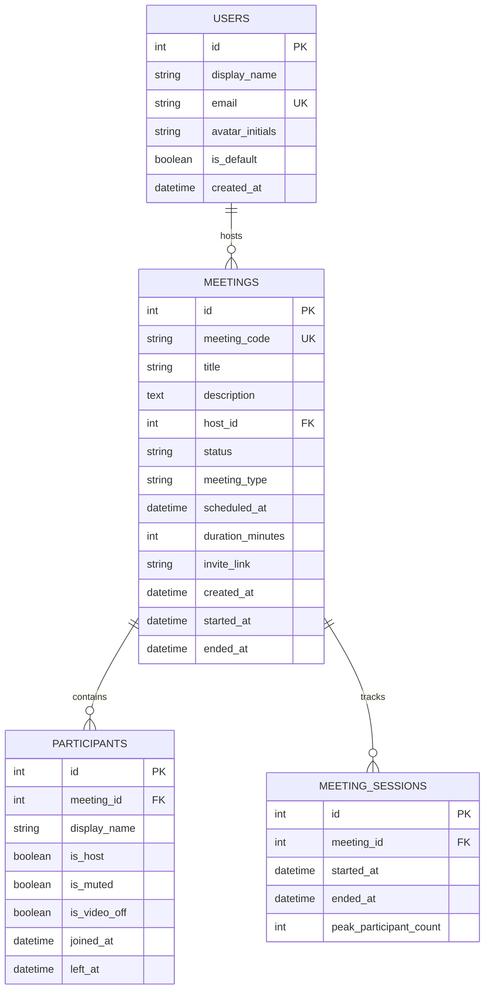

# Zoom Clone — Video Conferencing Web Platform

A full-stack, production-grade video conferencing web application built as an authentic clone of the **Zoom Web Platform** (`app.zoom.us` dashboard and meeting room). Built with **Next.js 14 (App Router)**, **TypeScript**, **Tailwind CSS**, **Python FastAPI**, **SQLAlchemy**, **Alembic**, and **WebRTC**.

---

## 🌟 Features Overview

### 1. Landing Dashboard (`/`)
- **Zoom Workplace Navigation**: Dark-mode header with profile avatar, global search, settings trigger, and system status indicator.
- **Hero Action Grid**:
  - **New Meeting**: Instantly launch an active video conference session with unique ID generation.
  - **Join Meeting**: Join any conference by entering a 9-digit Meeting ID or invite URL.
  - **Schedule Meeting**: Open modal to schedule future meetings with date, time, and duration pickers.
  - **Live Digital Clock**: Real-time clock widget matching Zoom's dashboard.
- **Upcoming Meetings List**: Displays future scheduled conferences sorted chronologically with copy link, delete, and launch triggers.
- **Recent Meetings History**: Historical log of past meetings with participant counts and re-open capability.

### 2. Instant Meeting Creation
- Generates human-readable 9-digit unique Meeting IDs in format `XXX-XXX-XXX`.
- Generates shareable invite URLs (`/join/{meeting_code}`).
- Persists meeting record and session state in SQLite database.
- Redirects host directly into the meeting room (auto-joined as host).

### 3. Join Meeting Flow (`/join/[code]`)
- Supports joining via direct URL or 9-digit Meeting ID input.
- Real-time pre-join camera and microphone preview using browser WebRTC `navigator.mediaDevices.getUserMedia`.
- Audio and video mute/unmute toggles before entering.
- Allows participants to specify and validate their display name.
- Validates meeting existence and active status against backend.

### 4. Schedule Meetings
- Title / Topic (Required, validated).
- Optional description & agenda notes.
- Date picker and start time selector.
- Configurable duration (15m, 30m, 45m, 60m, 90m, 120m).
- Automatic invite link generation and database persistence.
- Instantly appears in the Upcoming Meetings list.

### 5. Meeting Room (`/meeting/[code]`)
- **Live Video Grid**: Responsive gallery view displaying local user and remote attendees with active speaking & mute indicators.
- **Real-Time P2P WebRTC Video & Audio**: Direct peer-to-peer media streaming over WebSocket signaling with Google STUN servers.
- **Screen Sharing**: Live display capture (`navigator.mediaDevices.getDisplayMedia`) with seamless track replacement and auto-revert on end.
- **In-Meeting Real-Time Chat**: Slide-out chat drawer with sender avatars, timestamps, enter-to-send shortcut, and unread notification badge on the toolbar.
- **Zoom Control Bar**:
  - Mute / Unmute Microphone toggle.
  - Start / Stop Camera Video toggle.
  - Security / Encryption status badge (Host).
  - Participants drawer toggle with live badge count.
  - In-Meeting Chat drawer toggle with unread badge.
  - Share Screen toggle with active sharing status.
  - Reactions picker (👍, 👏, ❤️, 🎉, 😂, 😮).
  - Leave Meeting & Host "End Meeting for All" controls.
- **Participants Side Drawer**: Lists attendees, display names, join timestamps, and host actions (Mute All / Remove Participant).

---

## 🛠️ Technical Stack

- **Frontend**: Next.js 14 (App Router), TypeScript, Tailwind CSS, Lucide React, Axios, date-fns.
- **Backend**: Python 3.10+, FastAPI, SQLAlchemy 2.0 ORM, Alembic migrations, Pydantic v2, Uvicorn, WebSockets.
- **Database**: SQLite with relational foreign keys and indexes.
- **Real-Time & Media**: WebRTC P2P Mesh, WebSockets for SDP & ICE candidate exchange.

---

## 📁 Repository Structure

```
Zoom_Clone/
├── backend/
│   ├── alembic/              # Alembic migration environment and versions
│   │   ├── versions/         # Migration scripts (0001 initial schema)
│   │   └── env.py
│   ├── app/
│   │   ├── models/           # SQLAlchemy ORM models (User, Meeting, Participant, MeetingSession)
│   │   ├── schemas/          # Pydantic schemas for request/response validation
│   │   ├── services/         # Business logic layer (user_service, meeting_service)
│   │   ├── routers/          # FastAPI REST endpoints (/api/users, /api/meetings, /meetings)
│   │   │   ├── ws.py         # WebSocket WebRTC signaling server & room manager
│   │   │   ├── meetings.py
│   │   │   └── users.py
│   │   ├── utils/            # Meeting code generation & collision prevention
│   │   ├── config.py         # App configuration & settings
│   │   ├── database.py       # SQLAlchemy engine & session maker
│   │   └── main.py           # FastAPI entrypoint, router mounts & CORS middleware
│   ├── seed.py               # Database seeder with sample user and meetings
│   ├── test_ws_signaling.py  # Automated dual-client signaling test suite
│   ├── requirements.txt      # Python dependencies
│   ├── alembic.ini           # Alembic configuration
│   └── .env                  # Backend environment variables
├── frontend/
│   ├── app/
│   │   ├── join/[code]/      # Join meeting pre-call preview screen
│   │   ├── meeting/[code]/   # Live Zoom meeting room page
│   │   ├── globals.css       # Global Zoom dark styles & scrollbars
│   │   ├── layout.tsx        # App layout wrapper
│   │   └── page.tsx          # Landing dashboard page
│   ├── components/
│   │   ├── dashboard/        # Navbar, Sidebar, MeetingCard, JoinModal, ScheduleModal
│   │   ├── meeting/          # ControlBar, ParticipantTile, ParticipantsDrawer, ChatDrawer
│   │   └── ui/               # Toast feedback notifications
│   ├── hooks/
│   │   └── useWebRTC.ts      # Custom WebRTC peer connection & signaling hook
│   ├── services/             # Axios API service module
│   ├── types/                # TypeScript interfaces
│   ├── tailwind.config.js    # Zoom color palette configuration
│   └── package.json
└── README.md
```

---

## 🗄️ Database Architecture (SQLite Schema)



### Schema Design Decisions
- **`users`**: Seeded with default logged-in user (`Alex Morgan`). Ready for auth expansion (hashed_password, oauth tokens).
- **`meetings`**: Indexed on `meeting_code` (unique) and `host_id` for $O(1)$ lookups. Includes meeting lifecycle statuses (`scheduled`, `live`, `ended`).
- **`participants`**: Tracks active attendees, mute states, camera states, and host status per session.
- **`meeting_sessions`**: Telemetry table recording session start/end and peak attendee counts.

---

## 📡 WebRTC Signaling & Architecture Flow

```
[Browser A (Host)]               [FastAPI WebSocket]               [Browser B (Guest)]
       |                                  |                                  |
       |--- WS Connect (/ws/{code}) ----->|                                  |
       |<-- room-users (peers: []) -------|                                  |
       |                                  |<--- WS Connect (/ws/{code}) -----|
       |                                  |--- room-users (peers: [A]) ----->|
       |<-- user-joined (sender: B) ------|                                  |
       |                                  |<-- createOffer (SDP) ------------|
       |<-- offer (from B) ---------------|                                  |
       |--- createAnswer (SDP) ---------->|                                  |
       |                                  |--- answer (from A) ------------->|
       |<=> ICE candidates exchange ======|====== ICE candidates exchange <=|
       |                                                                     |
       |================ P2P Direct Media Stream (WebRTC) ==================|
```

1. **Signaling Server**: FastAPI WebSocket endpoint (`/ws/{meeting_code}` or `/ws/signal/{meeting_code}`) manages room rosters.
2. **STUN Configuration**: Google STUN servers (`stun.l.google.com:19302`, `stun1`, `stun2`) enable NAT traversal for peer discovery.
3. **Pre-added Transceivers**: Transceivers (`sendrecv`) are pre-created on `RTCPeerConnection` initialization so media sections are always negotiated even before the camera stream resolves.
4. **Dynamic Track Replacement**: `sender.replaceTrack(track)` swaps camera and screen share tracks on the fly with zero renegotiation lag.
5. **Autoplay Fallback**: Remote video elements handle browser autoplay restrictions gracefully by starting with muted playback if unmuted audio is blocked by browser policies.

---

## 🔌 API Endpoints Summary

| Method | Endpoint | Description |
| :--- | :--- | :--- |
| `GET` | `/api/health` | Service health status check |
| `GET` | `/api/users/me` | Fetch default logged-in user details |
| `GET` | `/api/meetings` or `/meetings` | List all meetings hosted by default user |
| `GET` | `/api/meetings/upcoming` or `/meetings/upcoming` | Fetch future scheduled meetings |
| `GET` | `/api/meetings/recent` or `/meetings/recent` | Fetch historical/ended meetings |
| `POST` | `/api/meetings/instant` or `/meetings/instant` | Create instant meeting room |
| `POST` | `/api/meetings/schedule` or `/meetings/schedule` | Schedule a future meeting |
| `GET` | `/api/meetings/{code}` or `/meetings/{code}` | Get meeting details by 9-digit code |
| `POST` | `/api/meetings/{code}/join` or `/meetings/{code}/join` | Register participant in meeting |
| `POST` | `/api/meetings/{code}/leave` | Mark participant left timestamp |
| `POST` | `/api/meetings/{code}/end` | Host action: End meeting for all |
| `GET` | `/api/meetings/{code}/participants` | List active participants in meeting |
| `DELETE` | `/api/meetings/{code}/participants/{id}` | Host action: Remove participant |
| `POST` | `/api/meetings/{code}/mute-all` | Host action: Mute all attendees |
| `WS` | `/ws/{meeting_code}` or `/ws/signal/{meeting_code}` | Real-time WebRTC signaling & chat |

---

## 🚀 Local Setup Instructions

### Prerequisites
- Node.js v18+ & npm
- Python 3.10+

### 1. Backend Setup (FastAPI & SQLite)

```bash
cd backend

# Create virtual environment (optional but recommended)
python -m venv venv
# On Windows:
venv\Scripts\activate
# On macOS/Linux:
source venv/bin/activate

# Install dependencies
pip install -r requirements.txt

# Run Alembic database migrations
python -m alembic upgrade head

# Seed SQLite database with sample user and meetings
python seed.py

# Start FastAPI server
python -m uvicorn app.main:app --reload --port 8000
```

FastAPI server runs at `http://localhost:8000`. Interactive API Docs are available at `http://localhost:8000/docs`.

### 2. Frontend Setup (Next.js 14)

```bash
cd frontend

# Install npm dependencies
npm install

# Start Next.js development server
npm run dev
```

Frontend application runs at `http://localhost:3000`.

---

## 🌍 Environment Variables

### Backend (`backend/.env`)
```env
DATABASE_URL=sqlite:///./zoom_clone.db
FRONTEND_URL=http://localhost:3000
APP_ENV=development
```

### Frontend (`frontend/.env.local`)
```env
NEXT_PUBLIC_API_URL=http://localhost:8000
```

---

## 🧪 Testing WebRTC Signaling

You can test the signaling layer independently with the automated dual-client test script:

```bash
cd backend
python test_ws_signaling.py
```

This simulates two peers joining the same room, exchanging offers, answers, ICE candidates, media state toggles, and chat messages.

---

## 💡 Assumptions & Architecture Notes

1. **Authentication**: Assumes a single default logged-in user (`Alex Morgan`, ID: 1) per the assignment specification. The database schema stores `host_id` foreign keys and participant user associations so session/JWT auth can be added without altering the database schema.
2. **WebRTC Topology**: Uses a peer-to-peer mesh topology. Mesh is optimal for 2–4 participants without requiring dedicated media servers (SFU/MCU). For larger scale (50+ participants), an SFU like LiveKit or mediasoup can replace the mesh signaling layer while keeping the exact same UI.
3. **Database**: SQLite accessed through SQLAlchemy 2.0 with Alembic versioning. Switching to PostgreSQL in production requires only changing `DATABASE_URL` in `.env`.
